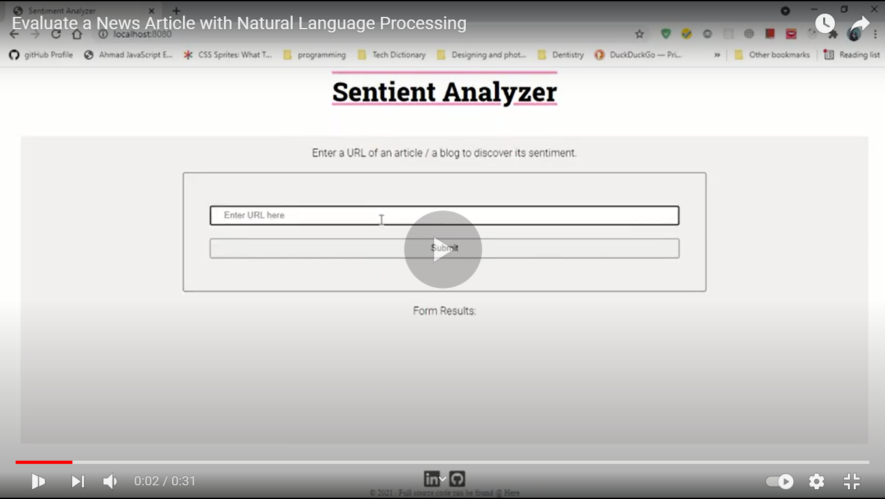
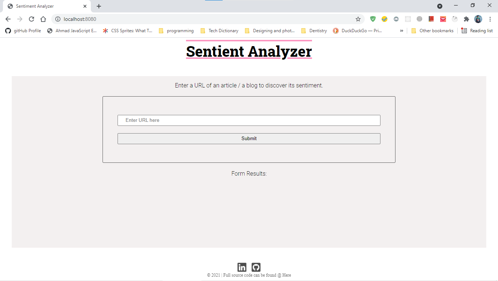
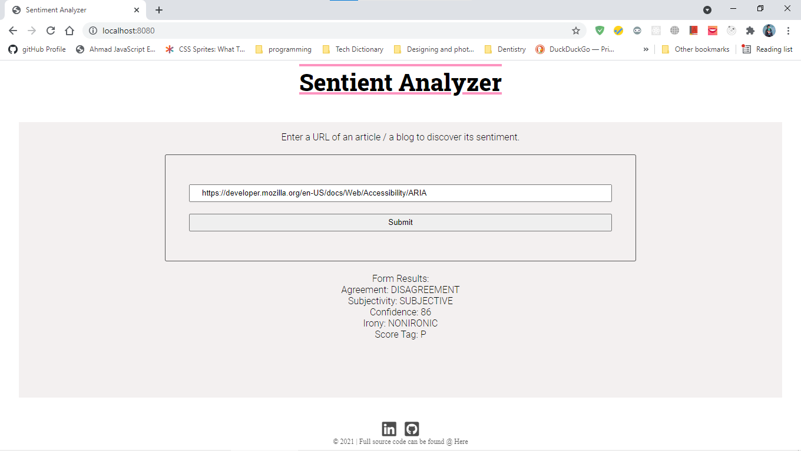
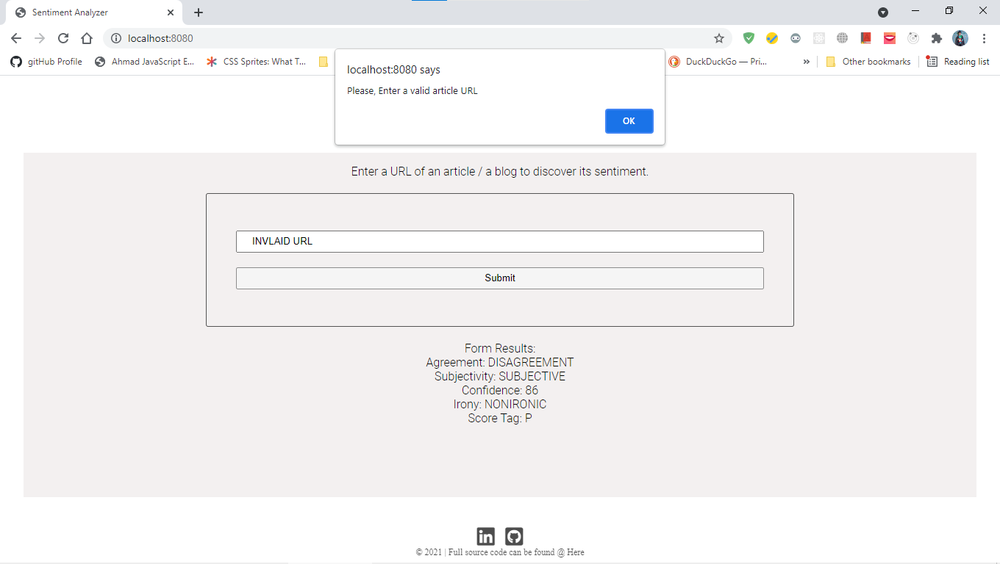
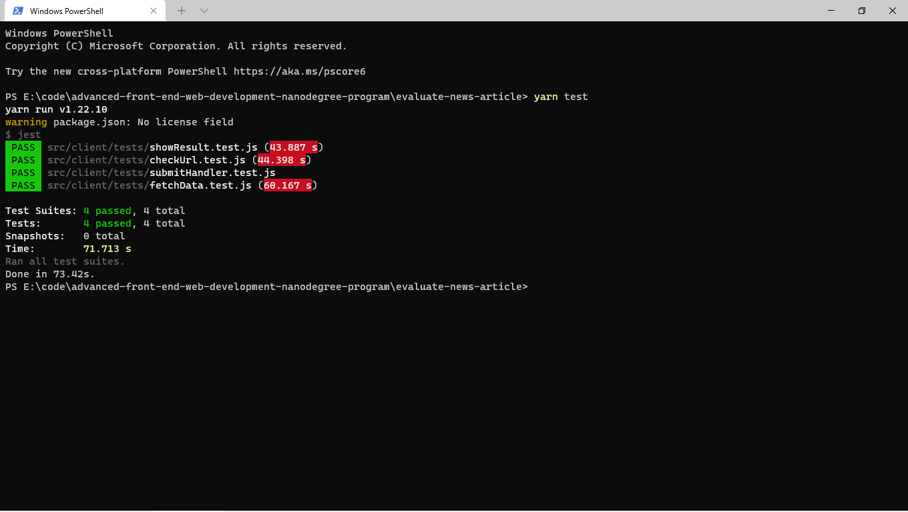

# Udacity Advanced front-end Nanodegree Project:

# Evaluate a news article with Natural Language Processing

## Video Demo

A video walk through is available here: https://youtu.be/fmIIIpOau_8 including installation and app overview.

## What We will be building

We will be building web tool that allows users to run Natural Language Processing (NLP) on articles or blogs found on other websites. Using Semantic Analysis <a href="https://learn.meaningcloud.com/developer/sentiment-analysis/2.1/doc">API from Meaning Cloud</a> , we can build a simple web interface to interact with their NLP system. This tool will give us back pertinent information about the article, like whether the content is subjective (opinion) or objective (fact-based).

# Technologies and Languages Used:

- Backend-Server:
  - ExpressJS(NodeJS)
  - Async/Await
- UI (Front-end):
  - Vanilla Javascript
  - Sass
  - HTML
- Tools:
  - Webpack
  - Git version Control System
  - Github
  - Github Pages, Live <a href="https://ahmedalima.github.io/evaluate-news-article/">Here</a>
- Testing:
  - Jest

## Interactions

The page built for this project is a simple one. It has a form with a single filed which receives an input. This input is checked for valid url. A helpful error message is displayed for invalid url. If the url is valid, then an api call is performed and the result displayed on the page.

### Home page

### API response - valid URL

### Invalid URL message

## Run project

Below shows how to run in development and production mode.

### Download Dependencies

`npm install` or `yarn`

### run in development mode

To start the webpack dev server at port 8080

` $ npm run build-dev` or `yarn build-dev`

Start back-end serve
`npm run start` or `yarn start`

### run in production mode

Generate the dist files and then start server at port 3000

` $ npm run build-prod` or `yarn build-prod`

` $ npm run start` or `yarn start`

## Configs files

- Webpack
  - Dev Configs: `webpack.config.dev.js`
    - Not optimized build
    - source map
  - Production `webpack.config.prod.js`
    - Optimized build
    - Auto generated HTML from template
- Dependency
  - `package.json`

## API

The project uses Semantic Text Analysis SDKs from [Meaning Cloud](https://learn.meaningcloud.com/developer/sentiment-analysis/2.1/doc), which provides a powerful and flexible AI-driven content analysis solutions.

## Offline Functionality

The project have service workers set up in webpack to provide the offline functionality of our app. When the service worker is functioning correctly, you will see the below message when you inspect the browser.

## Testing

Testing is done with Jest. To run test, use the command

`npm run test` or `yarn test`

